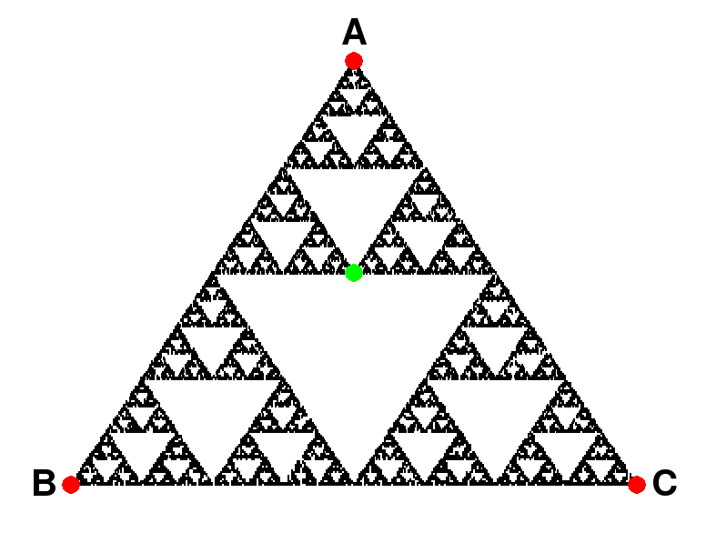

# Generative Art

A Python project for creating generative art. This repository serves as a sandbox to create generative art.

## Web App

Run the web app to view and generate art:

```
python app.py
```

## Example Art

Examples can be found [here](static/).

## Game Chaos

`triangle.py` generates the Sierpiński triangle with random die rolls. The project was inspired by the below Numberphile video.

[](https://www.youtube.com/watch?v=kbKtFN71Lfs "Chaos Game - Numberphile")

The code in `triangle.py` will produce an image that looks something like this:


### Running the code

To run the code, type: `python triangle.py`

## License

This project is covered by the [MIT License](LICENSE).
